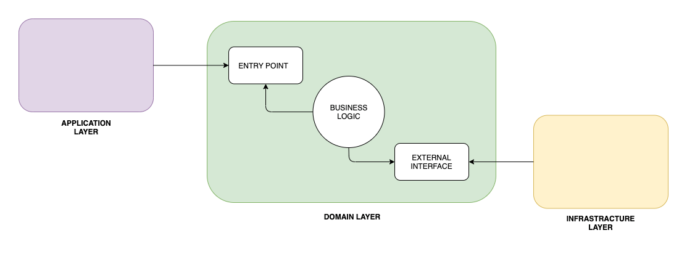
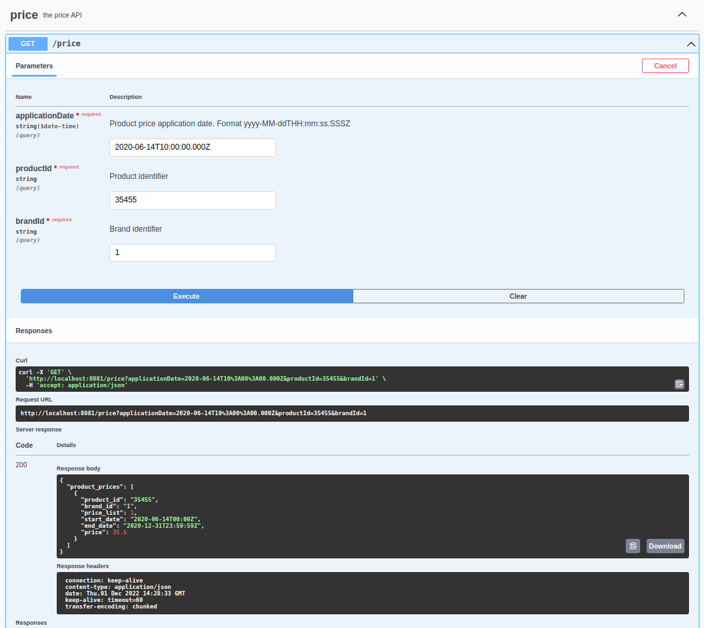

## Inditex test Nahuel Ariel Ojea

Technical test for getting product prices by application date.

### Hexagonal Architecture

Hexagonal architecture is a model of designing software applications around domain logic to isolate it from external factors.

The domain logic is specified in a business core, which we'll call the inside part, the rest being outside parts. Access to domain logic from the outside is available through ports and adapters.

Firstly, we should define principles to divide our code. As explained briefly already, hexagonal architecture defines the inside and the outside part.


freestar
What we'll do instead is divide our application into three layers; application (outside), domain (inside), and infrastructure (outside):



Through the application layer, the user or any other program interacts with the application. This area should contain things like user interfaces, RESTful controllers, and JSON serialization libraries. It includes anything that exposes entry to our application and orchestrates the execution of domain logic.

In the domain layer, we keep the code that touches and implements business logic. This is the core of our application. Additionally, this layer should be isolated from both the application part and the infrastructure part. On top of that, it should also contain interfaces that define the API to communicate with external parts, like the database, which the domain interacts with.

Lastly, the infrastructure layer is the part that contains anything that the application needs to work such as database configuration or Spring configuration. Besides, it also implements infrastructure-dependent interfaces from the domain layer.

More information in the following link:

- [Organizing Layers Using Hexagonal Architecture, DDD, and Spring](https://www.baeldung.com/hexagonal-architecture-ddd-spring)

### Database

This project has an H2 in-memory database. We will persist the initial data for testing.

In order to access the data we must login in at the following link with the data we see in the image.

- [H2 console](http://localhost:8081/h2-console)


### Documentation

Project documentation was done through Swagger and OpenAPI. The requested endpoint is documented along with input and response data. 

- [Swagger](http://localhost:8081/swagger-ui/index.html)

The OpenAPI maven plugin was used for the code generation

- [API-First Development with Spring Boot and Swagger](https://reflectoring.io/spring-boot-openapi/)


## Run Spring Boot application with Docker

Create Docker image:
```
 docker build --tag=inditex:latest .
```

Run Docker container:

```
 docker run -p8081:8081 inditex:latest
```

## REST Request example



Curl:
```
 curl -X 'GET' \
  'http://localhost:8081/price?applicationDate=2020-06-14T10%3A00%3A00.000Z&productId=35455&brandId=1' \
  -H 'accept: application/json'
```

Request URL:
```
http://localhost:8081/price?applicationDate=2020-06-14T10%3A00%3A00.000Z&productId=35455&brandId=1
```

More examples:

```
 curl -X 'GET' \
  'http://localhost:8081/price?applicationDate=2020-06-14T16%3A00%3A00.000Z&productId=35455&brandId=1' \
  -H 'accept: application/json'
```
```
 curl -X 'GET' \
  'http://localhost:8081/price?applicationDate=2020-06-14T21%3A00%3A00.000Z&productId=35455&brandId=1' \
  -H 'accept: application/json'
```
```
 curl -X 'GET' \
  'http://localhost:8081/price?applicationDate=2020-06-15T10%3A00%3A00.000Z&productId=35455&brandId=1' \
  -H 'accept: application/json'
```
```
 curl -X 'GET' \
  'http://localhost:8081/price?applicationDate=2020-06-16T21%3A00%3A00.000Z&productId=35455&brandId=1' \
  -H 'accept: application/json'
```